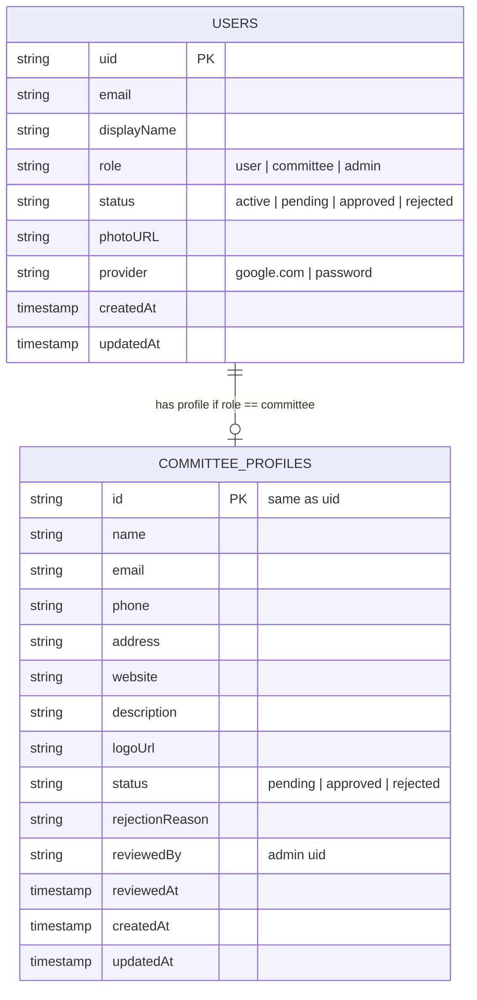
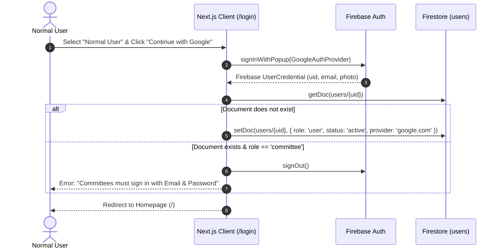
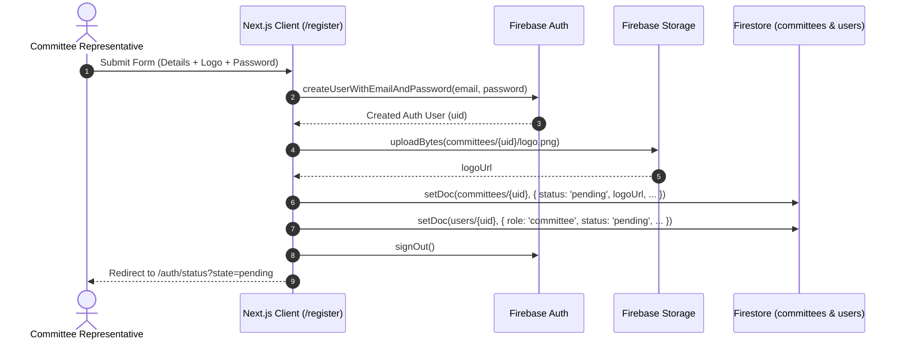
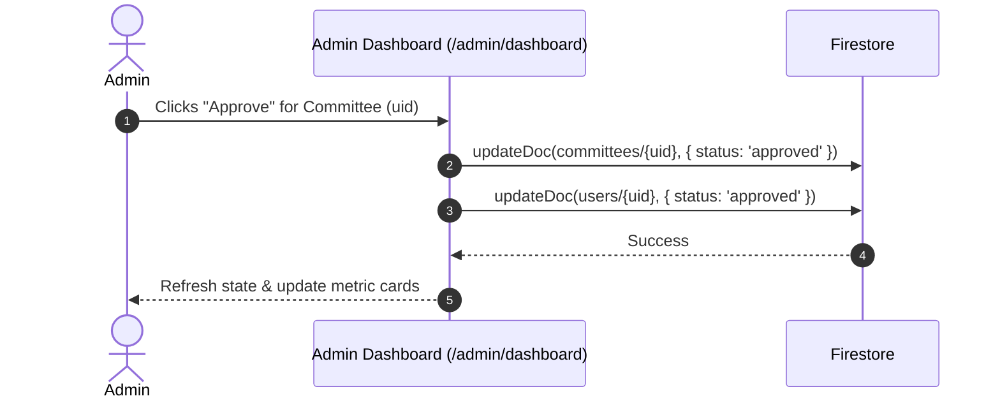

# Carvaan - Authentication Module Implementation Design

## 1. Executive Summary & Objective

This document defines the complete architectural and implementation design for the **Authentication & Authorization Module** of the **Carvaan** web application.

Based on [docs/Solution.md](file:///Users/khurramrizvi/Development/Hackathon/Carvaan/docs/Solution.md) and [docs/Design.md](file:///Users/khurramrizvi/Development/Hackathon/Carvaan/docs/Design.md), the system requires strict role separation, dedicated sign-in mechanisms per role, a committee approval lifecycle, and role-based route protection built on **Next.js (App Router)**, **TypeScript**, and **Firebase (Auth, Firestore, Storage)**.

---

## 2. User Roles & Identity Matrix

| Role | Allowed Sign-In Provider | Self-Registration? | Access Level | Initial State |
| :--- | :--- | :--- | :--- | :--- |
| **Normal User** | Google OAuth ONLY | Yes (Automatic via Google) | View Juloos, view details, register as volunteer, report SOS, register Niyaz | `active` |
| **Committee** | Email & Password ONLY | Yes (Pending review) | Manage committee Juloos, approve volunteers, manage lost & found, Niyaz & SOS | `pending` |
| **Admin** | Email & Password (Dedicated) | No (Pre-seeded / Configured) | Review committee registration requests (Approve / Reject), view metric cards | `active` |
| **Volunteer** | Derived Role (Normal User) | No (Approved per-event by Committee) | Scan Niyaz QR, report lost & found, view SOS, mark attendance | Active in Event |

> [!IMPORTANT]
> **Strict Provider Constraints:**
> - Committee accounts **CANNOT** sign in via Google.
> - Normal Users **CANNOT** register or sign in via Email/Password.
> - Any sign-in attempt violating this rule will be intercepted and rejected with an explicit, helpful error message.

---

## 3. Architecture & Data Model

### 3.1 Firebase Collections & Schema



#### Collection: `users`
Document ID: `uid` (Firebase Auth UID)
```typescript
export interface UserProfile {
  uid: string;
  email: string;
  displayName: string;
  role: 'user' | 'committee' | 'admin';
  status: 'active' | 'pending' | 'approved' | 'rejected';
  provider: 'google.com' | 'password';
  photoURL?: string;
  createdAt: number; // epoch ms or serverTimestamp
  updatedAt: number;
}
```

#### Collection: `committees`
Document ID: `uid` (Matches Firebase Auth UID of the Committee)
```typescript
export interface CommitteeProfile {
  id: string; // matches uid
  name: string;
  email: string;
  phone: string;
  address: string;
  website?: string;
  description: string;
  logoUrl: string;
  status: 'pending' | 'approved' | 'rejected';
  rejectionReason?: string;
  reviewedBy?: string;
  reviewedAt?: number;
  createdAt: number;
  updatedAt: number;
}
```

---

## 4. Authentication Flows & Sequence Diagrams

### 4.1 Flow 1: Normal User Sign-in (Google OAuth)

1. User opens the application $\rightarrow$ Redirected to `/login`.
2. User selects **"Normal User"** radio option.
3. UI presents the **"Continue with Google"** button (Cobalt/Pill style).
4. On click, `signInWithPopup(auth, googleProvider)` triggers.
5. On success:
   - System checks if `users/{uid}` exists.
   - If not found: Automatically provision `users/{uid}` with `role: 'user'`, `status: 'active'`, `provider: 'google.com'`.
   - If found: Ensure `role == 'user'`. If user is registered as a committee, block sign-in and force Email/Password flow.
6. Redirect to `/` (Homepage / Juloos list).



---

### 4.2 Flow 2: Committee Registration Flow

1. User visits `/register` $\rightarrow$ Selects **"Committee"**.
2. Form fields rendered per `Solution.md`:
   - Logo (file upload)
   - Name
   - Email & Password
   - Phone Number
   - Address
   - Website (optional)
   - Description
3. **Form Submission Process:**
   - Step A: Create Firebase Auth user using `createUserWithEmailAndPassword(auth, email, password)`.
   - Step B: Upload Committee Logo to Firebase Storage: `committees/{uid}/logo.png`.
   - Step C: Create `committees/{uid}` record with `status: 'pending'`.
   - Step D: Create `users/{uid}` record with `role: 'committee'`, `status: 'pending'`, `provider: 'password'`.
   - Step E: Sign out the user immediately (`signOut(auth)`) to avoid auto-authenticated session before admin approval.
   - Step F: Redirect to `/auth/status?state=pending` informing the committee their application is under review.



---

### 4.3 Flow 3: Committee Login Flow & Status Check

1. User visits `/login` $\rightarrow$ Selects **"Committee"**.
2. Form shows Email & Password inputs.
3. On submit: `signInWithEmailAndPassword(auth, email, password)`.
4. Verification step:
   - Query `users/{uid}` or `committees/{uid}`.
   - Check `role == 'committee'`.
   - Evaluate `status`:
     - **If `status == 'pending'`**:
       Sign out session immediately $\rightarrow$ Redirect to `/auth/status?state=pending`.
     - **If `status == 'rejected'`**:
       Sign out session immediately $\rightarrow$ Redirect to `/auth/status?state=rejected` (shows admin contact / reapply note).
     - **If `status == 'approved'`**:
       Grant access $\rightarrow$ Redirect to `/committee/dashboard` or `/`.

---

### 4.4 Flow 4: Admin Authentication & Review Workflow

1. Admin accesses `/admin/login` (independent, clean authentication portal).
2. Fixed credentials or dedicated admin credentials authenticated via Firebase Auth.
3. Verification: verify `role == 'admin'` in `users/{uid}` or environment-configured Super Admin UID.
4. On success $\rightarrow$ `/admin/dashboard`.
5. Dashboard functionality:
   - Metric Cards: Total Committees, Approved, Rejected, Pending.
   - Live Table of all committees with filters & actions.
   - Admin clicks **Approve**:
     - Updates `committees/{id}`: `{ status: 'approved', reviewedAt: now, reviewedBy: adminUid }`.
     - Updates `users/{id}`: `{ status: 'approved' }`.
   - Admin clicks **Reject**:
     - Updates `committees/{id}`: `{ status: 'rejected', rejectionReason: optional, reviewedAt: now }`.
     - Updates `users/{id}`: `{ status: 'rejected' }`.



---

## 5. Route Protection & Middleware Design

### 5.1 Route Hierarchy

```
/
├── (public/auth)
│   ├── /login                 # Dual role login (Committee vs Normal User)
│   ├── /register              # Dual role register
│   ├── /auth/status           # Pending / Rejected notification screen
│   └── /admin/login           # Dedicated Admin login
│
├── (user & volunteer)
│   ├── /                      # Homepage (All live Juloos events)
│   └── /events/[id]           # Event details, SOS, Lost & Found, Niyaz, Volunteer apply
│
├── (committee)                # Protected: role == 'committee' && status == 'approved'
│   ├── /committee/events
│   ├── /committee/events/[id] # Dedicated cards (Volunteers, SOS, Niyaz, Lost & Found)
│   └── /committee/profile
│
└── (admin)                    # Protected: role == 'admin'
    └── /admin/dashboard       # Committee approvals & metrics
```

### 5.2 Next.js Auth Context & Guards

- **`AuthContext` (`context/AuthContext.tsx`)**:
  - Subscribes to `onAuthStateChanged(auth)`.
  - On auth state: fetches user profile (`users/{uid}`) and committee profile if applicable.
  - Exposes:
    ```typescript
    interface AuthContextType {
      user: User | null;
      userProfile: UserProfile | null;
      committeeProfile: CommitteeProfile | null;
      loading: boolean;
      loginWithGoogle: () => Promise<void>;
      loginWithEmail: (email: string, pass: string, role: 'committee' | 'admin') => Promise<void>;
      registerCommittee: (data: CommitteeRegisterInput) => Promise<void>;
      logout: () => Promise<void>;
    }
    ```
- **`RoleGuard` Component / Higher Order Wrapper**:
  - `allowedRoles: ('user' | 'committee' | 'admin')[]`
  - `requireApprovedStatus?: boolean`
  - Displays branded loading spinner while verifying token & claims.
  - Automatically redirects unauthorized users to `/login` or `/auth/status`.

---

## 6. UI/UX Design System Compliance (Meta-Inspired)

In accordance with [docs/Design.md](file:///Users/khurramrizvi/Development/Hackathon/Carvaan/docs/Design.md):

1. **Role Switcher on Login/Register**:
   - Radio option card container (`radio-option` & `radio-option-selected`).
   - Selected state: `2px solid #0143b5` (deep cobalt) border with light tint.
2. **Buttons**:
   - Google Sign-in: Outlined pill (`button-secondary` / white card with Google icon and deep ink label).
   - Committee Submit / Login CTA: Cobalt pill button (`button-buy-cta` / `{rounded.full}`).
3. **Form Inputs**:
   - `text-input`: 44px height, `{rounded.lg}` (8px), `{colors.hairline}` border, focus ring `2px solid {colors.fb-blue}`.
   - Text inputs with clean floating/stacked labels and inline error validation (`{colors.critical-strong}`).
4. **Mobile First Responsive Rules**:
   - Full viewport mobile card layout with responsive padding (`16px` mobile, `32px` desktop).
   - Centered card container on desktop (`max-w-md` for auth, `max-w-xl` for committee registration).

---

## 7. Security Rules (Firestore & Storage)

### 7.1 Firestore Security Rules (`firestore.rules`)
```javascript
rules_version = '2';
service cloud.firestore {
  match /databases/{database}/documents {

    // Helper functions
    function isAuthenticated() {
      return request.auth != null;
    }
    function isOwner(userId) {
      return isAuthenticated() && request.auth.uid == userId;
    }
    function isAdmin() {
      return isAuthenticated() && 
        get(/databases/$(database)/documents/users/$(request.auth.uid)).data.role == 'admin';
    }
    function isApprovedCommittee() {
      return isAuthenticated() &&
        get(/databases/$(database)/documents/users/$(request.auth.uid)).data.role == 'committee' &&
        get(/databases/$(database)/documents/users/$(request.auth.uid)).data.status == 'approved';
    }

    // User profiles
    match /users/{userId} {
      allow read: if isAuthenticated();
      // User can create their own profile during signup
      allow create: if isOwner(userId);
      // Only admin can update role or status; user can update displayName/photoURL
      allow update: if isAdmin() || (isOwner(userId) && !request.resource.data.diff(resource.data).affectedKeys().hasAny(['role', 'status']));
      allow delete: if isAdmin();
    }

    // Committee profiles
    match /committees/{committeeId} {
      allow read: if isAuthenticated();
      allow create: if isOwner(committeeId) && request.resource.data.status == 'pending';
      // Only admin can approve/reject; committee can edit details if approved without altering status
      allow update: if isAdmin() || (isOwner(committeeId) && isApprovedCommittee() && !request.resource.data.diff(resource.data).affectedKeys().hasAny(['status']));
      allow delete: if isAdmin();
    }
  }
}
```

### 7.2 Storage Security Rules (`storage.rules`)
```javascript
rules_version = '2';
service firebase.storage {
  match /b/{bucket}/o {
    match /committees/{userId}/{fileName} {
      // Allow upload only by the committee owner or admin, max 5MB, image only
      allow write: if request.auth != null && (request.auth.uid == userId)
                   && request.resource.size < 5 * 1024 * 1024
                   && request.resource.contentType.matches('image/.*');
      allow read: if true; // Publicly readable for event listings
    }
  }
}
```

---

## 8. Implementation File Structure

```
/
├── app/
│   ├── (auth)/
│   │   ├── login/
│   │   │   └── page.tsx              # Role-toggle Login (Committee / User)
│   │   ├── register/
│   │   │   └── page.tsx              # Normal User Google Auth / Committee Registration Form
│   │   └── status/
│   │       └── page.tsx              # Pending / Rejected Status Info Page
│   ├── admin/
│   │   ├── login/
│   │   │   └── page.tsx              # Dedicated Admin Login
│   │   └── dashboard/
│   │       └── page.tsx              # Committee Review & Approval Metrics
│   └── layout.tsx                    # Root layout with AuthProvider
│
├── components/
│   ├── auth/
│   │   ├── LoginForm.tsx             # Interactive email/password + Google button
│   │   ├── CommitteeRegisterForm.tsx # 7-field registration + logo upload preview
│   │   ├── RoleSelector.tsx          # Meta-styled dual radio pills
│   │   └── ProtectedRoute.tsx        # Client-side guard for role & approval status
│   └── ui/
│       ├── Button.tsx                # Meta pill button variants
│       ├── Input.tsx                 # Meta standard form input
│       └── StatusBadge.tsx           # Status tags (Pending, Approved, Rejected)
│
├── context/
│   └── AuthContext.tsx               # Global Firebase Auth & Firestore state
│
├── lib/
│   └── firebase/
│       ├── client.ts                 # Firebase app, auth, db, storage init
│       ├── auth-services.ts          # Core authentication & registration functions
│       └── committee-services.ts     # Admin approvals & profile queries
```

---

## 9. Next Steps for Implementation

1. **Initialize Next.js 14/15 App Router project** with Tailwind CSS and TypeScript.
2. **Configure Firebase Client SDK** with credentials from [firebase-config.ts](file:///Users/khurramrizvi/Development/Hackathon/Carvaan/firebase-config.ts).
3. **Build `AuthContext` and Custom Hooks** (`useAuth`, `useRole`).
4. **Develop Auth Components & Pages**:
   - `RoleSelector` (Committee vs Normal User toggle).
   - `/login` with conditional form controls.
   - `/register` with logo file upload to Firebase Storage and document creation.
   - `/auth/status` for pending/rejected feedback.
5. **Develop Admin Authentication & Approval Portal** (`/admin/login` & `/admin/dashboard`).
6. **Deploy & Validate Firestore / Storage Security Rules**.
